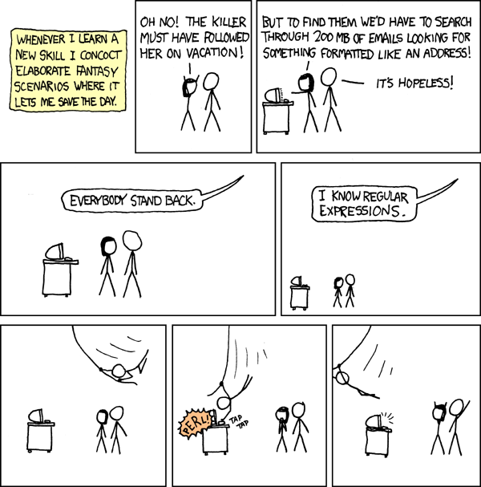

# How much regex should I know?

> September 20, 2026

Regular expressions have been a feature that always haunted me ever since I first "learned" about them. I've known about their complexity from the first moment on, but I've never really taken the time to explore them or to decide precisely whether I should spend time on deeply understanding them or not, and I believe that's a thought that crosses many developers' heads.

Why should someone take the time to learn regex's intricate features when we have so many facilitators to its usage? From early on in my career, I've been relying on the knowledge others share in forums such as [Stack OverFlow](https://stackoverflow.com/) and validators such as [Regex101](https://regex101.com/). Nowadays, we can even use LLMs to translate our natural language demands into regexp.

Even more pertinent, should someone with a busy life and a lot of other subjects that have wider use cases pending take time to learn the complexities of the system of special strings that matches a search pattern? For most developers, my case included, the need for regex is very sporadic and less frequent than most of the other subjects.

So we've established that I have had a resistance to taking time to learn regex. Even though that's the case, it still bothers me that every time I have to use it I need to rely blindly on the validation of some tooling or an LLM. Don't get me wrong, I will still use those to validate it and I still don't want to learn every detail about regex syntax. But I have the strong feeling that my soul will have more peace once I establish the fundamentals of regex in a solid place in my brain. 

That's why we're here essentially. I have a few reasons to want to explore regex at this point of my life even though it's a very cryptic and niche concept:

- [Performance bottlenecks:](https://blog.codinghorror.com/regex-performance/) when used inappropriately.
- [Search & replace:](https://www.zettlr.com/post/advanced-search-replace-regular-expressions) not only in programming languages, but in your IDE, excel, google sheets, search engine. It can be a huge time-saver for big and complex operations. 
- Expanding your problem-solving repertoire: when we're not familiar with regex, we can only think of it for some simple use cases such as e-mail or other simple validation processes or not even that, sometimes we'll resort to something made by hand like a manual function which can be longer, harder to maintain and a lot more inefficient. When, in fact, we could be using it for other cases, such as: extracting normalized data, examining verbose logs, restructuring input, creating a powerful validation engine and so forth. We can even save the world:

Well, that's it for today. Stick around to see the next chapters of my journey in exploring regex and what of it I find useful for my day-to-day life. Ciao! 